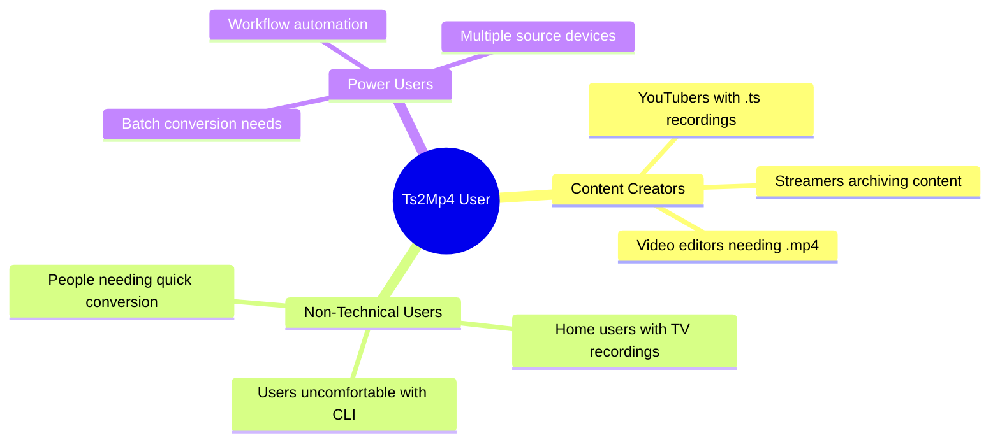
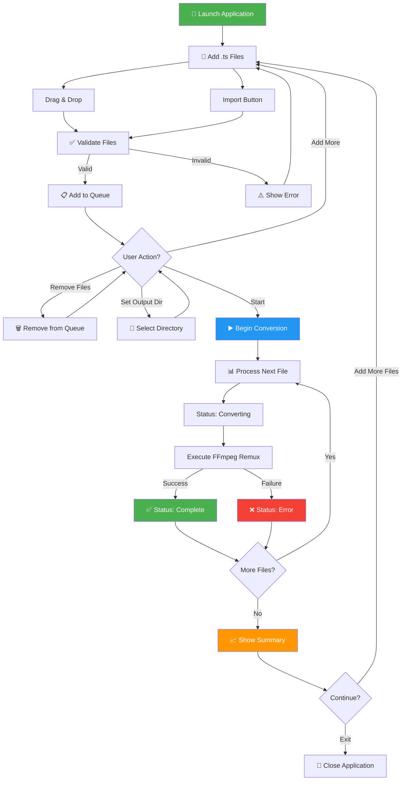
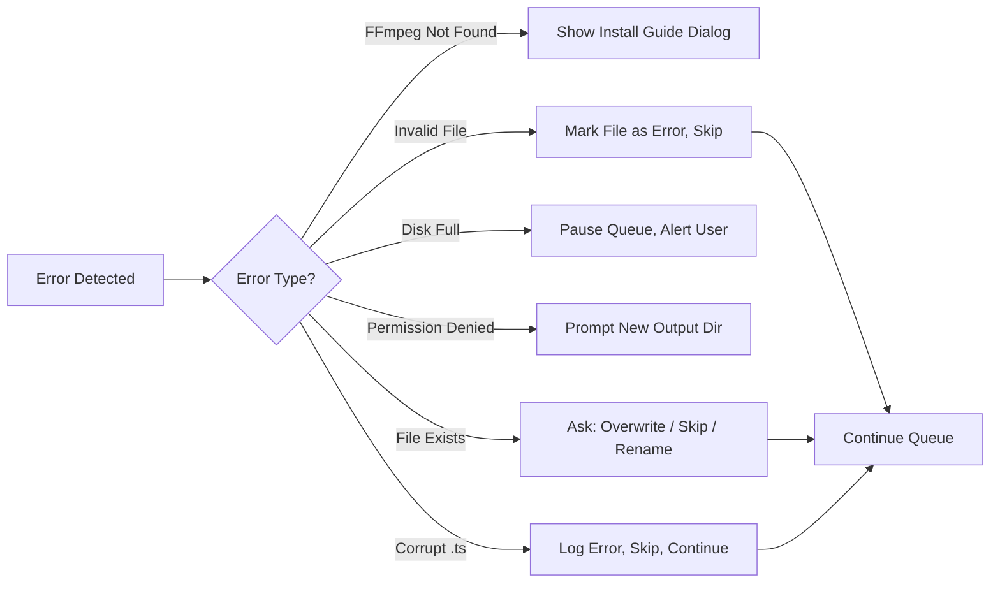
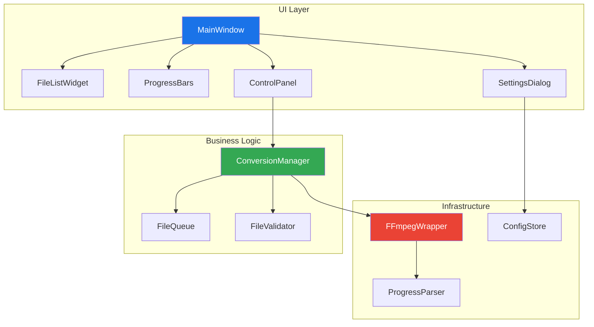
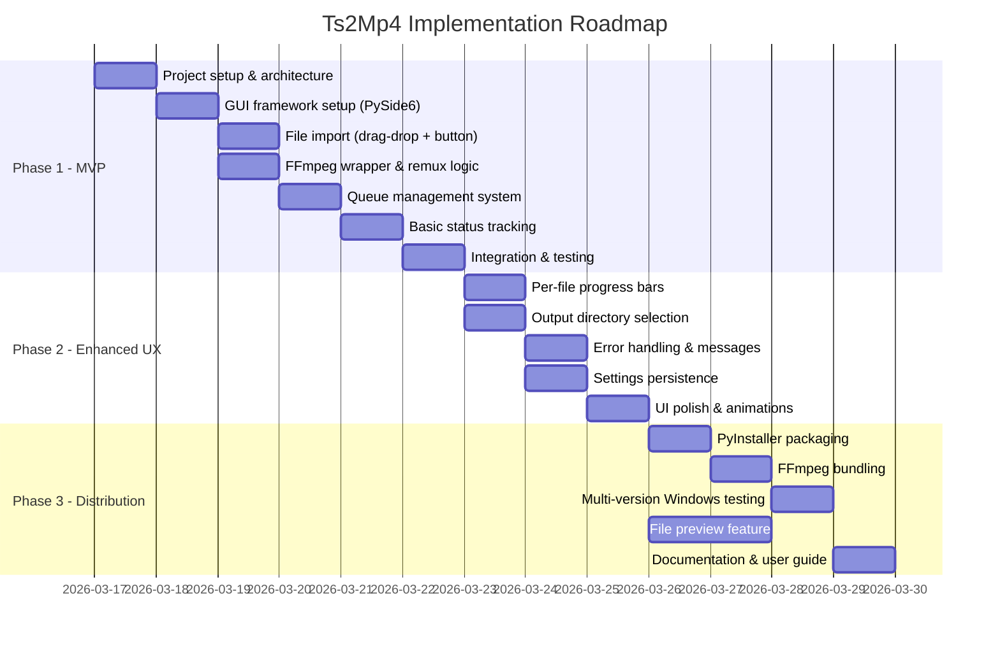

# 📊 Business Analysis Report: Ts2Mp4 Converter

> **Project:** Ts2Mp4 — Standalone Video Container Converter  
> **Date:** 2026-03-16  
> **Analyst:** AI-Powered Business Analysis  
> **Status:** Requirements Analysis Phase  

---

## 1. Executive Summary

The **Ts2Mp4** project aims to build a standalone Windows desktop application that converts `.ts` (MPEG Transport Stream) video files to `.mp4` (MPEG-4 Part 14) format using FFmpeg **remuxing** — a container-only conversion with zero quality loss and near-instant speed.

> [!IMPORTANT]
> The core technical approach (remuxing via `ffmpeg -c copy`) is the optimal choice: it's **100x faster** than re-encoding, uses **minimal CPU**, and delivers **bit-perfect quality preservation**.

### Value Proposition

| Dimension | Value |
|-----------|-------|
| **Speed** | Near-instant (limited only by disk I/O) |
| **Quality** | Zero loss — bitstream identical to source |
| **CPU Usage** | Minimal (~1-3% vs. 80-100% for re-encoding) |
| **Usability** | GUI with drag-and-drop, no CLI knowledge needed |
| **Cost** | Free, open-source tooling (FFmpeg + Python) |

---

## 2. Market & Competitive Analysis

### 2.1 Target Market

**.ts files are commonly produced by:**
- 📺 IPTV and satellite TV recording devices
- 🖥️ Screen recording software (OBS Studio, etc.)
- 📡 Digital broadcast capture hardware
- 🎥 Professional video cameras (AVCHD format variants)
- 🔄 Streaming platform downloads/captures

### 2.2 Target User Persona



### 2.3 Competitive Landscape

| Tool | Remux Support | Batch | GUI | Size | Free | Focus |
|------|:---:|:---:|:---:|------|:---:|-------|
| **Ts2Mp4** (ours) | ✅ | ✅ | ✅ | ~30MB | ✅ | .ts→.mp4 only |
| HandBrake | ❌ re-encode | ✅ | ✅ | ~50MB | ✅ | General encoding |
| FFmpeg CLI | ✅ | ✅ | ❌ | ~80MB | ✅ | Everything |
| VLC | ⚠️ | ❌ | ⚠️ Poor | ~150MB | ✅ | Media player |
| Online Converters | ❌ | ❌ | ✅ Web | N/A | ⚠️ | General conversion |
| MKVToolNix | ✅ MKV only | ✅ | ✅ | ~25MB | ✅ | MKV tooling |

> [!TIP]
> **Market Gap Identified:** No existing tool provides a clean, focused, lightweight GUI specifically for `.ts` → `.mp4` remuxing with batch support. HandBrake re-encodes (slow), FFmpeg needs CLI skills, VLC batch UX is poor.

### 2.4 SWOT Analysis

| | **Positive** | **Negative** |
|---|---|---|
| **Internal** | **Strengths:** Focused scope, fast remux, simple UX, lightweight | **Weaknesses:** Single format pair, depends on FFmpeg, new/unknown tool |
| **External** | **Opportunities:** Growing .ts file usage, underserved niche, expandable to other format pairs | **Threats:** FFmpeg GUI wrappers, OS built-in conversion, format obsolescence |

---

## 3. Requirements Analysis

### 3.1 Functional Requirements Matrix

| ID | Requirement | Priority | Complexity | Phase |
|----|------------|:--------:|:----------:|:-----:|
| **FR-01** | GUI window with drag-and-drop for multiple .ts files | 🔴 Critical | Medium | 1 |
| **FR-02** | Button-based file import (file dialog) | 🔴 Critical | Low | 1 |
| **FR-03** | Custom output directory selection | 🟡 High | Low | 1 |
| **FR-04** | Default output = same directory as source | 🟡 High | Low | 1 |
| **FR-05** | File name preservation (.ts → .mp4) | 🔴 Critical | Low | 1 |
| **FR-06** | File list display (name, path, status) | 🔴 Critical | Medium | 1 |
| **FR-07** | Per-file progress bar | 🟡 High | High | 2 |
| **FR-08** | Status tracking: Pending → Converting → Complete/Error | 🔴 Critical | Medium | 1 |
| **FR-09** | FFmpeg remux execution (`-c copy`) | 🔴 Critical | Medium | 1 |
| **FR-10** | Sequential queue-based batch processing | 🔴 Critical | Medium | 1 |
| **FR-11** | Add/remove files from queue before start | 🟡 High | Low | 1 |
| **FR-12** | File preview before conversion | 🟢 Nice-to-have | Medium | 3 |

### 3.2 Non-Functional Requirements

| ID | Requirement | Target | Measurement |
|----|------------|--------|-------------|
| **NFR-01** | Python 3.x implementation | 3.10+ | Code compatibility |
| **NFR-02** | Standalone .exe packaging | No Python required | User testing |
| **NFR-03** | FFmpeg availability | Bundled or documented | Installer testing |
| **NFR-04** | Error messages | Clear, actionable | UX review |
| **NFR-05** | Startup time | < 3 seconds | Benchmark |
| **NFR-06** | Memory usage | < 100MB during conversion | Profiling |
| **NFR-07** | GUI responsiveness | No freezing during conversion | Background threading |
| **NFR-08** | Package size | < 50MB (excluding FFmpeg) | Build measurement |
| **NFR-09** | Windows compatibility | Windows 10/11 x64 | Multi-version testing |

---

## 4. User Stories & Acceptance Criteria

### US-01: File Import via Drag and Drop
> **As a** user, **I want to** drag and drop .ts files onto the application window, **so that** I can quickly add files for conversion without navigating file dialogs.

**Acceptance Criteria:**
- [ ] Dragging 1+ `.ts` files onto the window adds them to the queue
- [ ] Non-`.ts` files are rejected with a clear message
- [ ] Duplicate files are detected and not added twice
- [ ] Files appear immediately in the queue list

### US-02: File Import via Button
> **As a** user, **I want to** click an import button to browse and select files, **so that** I have an alternative to drag-and-drop.

**Acceptance Criteria:**
- [ ] "Add Files" button opens a file dialog filtered to `.ts` files
- [ ] Multi-select is supported
- [ ] Selected files are added to the existing queue (not replacing)

### US-03: Output Directory Selection
> **As a** user, **I want to** choose where converted files are saved, **so that** I can organize my output files.

**Acceptance Criteria:**
- [ ] Default: save in same directory as source file
- [ ] "Browse" button to select custom output directory
- [ ] Selected path is displayed and persisted during session
- [ ] Invalid/read-only directories show an error

### US-04: Batch Conversion
> **As a** user, **I want to** convert multiple files in one operation, **so that** I don't have to process files one by one.

**Acceptance Criteria:**
- [ ] "Start" button begins sequential processing of all queued files
- [ ] Each file shows its current status (Pending/Converting/Complete/Error)
- [ ] Progress bar updates for the active file
- [ ] Queue continues after a file error (doesn't stop all)
- [ ] Summary shown when all files are processed

### US-05: Queue Management
> **As a** user, **I want to** add or remove files from the queue before starting, **so that** I can curate my conversion list.

**Acceptance Criteria:**
- [ ] Remove button/action for individual files
- [ ] "Clear All" option available
- [ ] Add more files while queue is not processing
- [ ] Queue cannot be modified during active conversion

### US-06: Conversion Progress
> **As a** user, **I want to** see the progress of each conversion, **so that** I know how long it will take and if anything went wrong.

**Acceptance Criteria:**
- [ ] Progress bar shows % completion per file
- [ ] Status text updates in real-time
- [ ] Error details displayed for failed conversions
- [ ] Total queue progress visible (e.g., "3 of 10 complete")

### US-07: File Preview (Optional)
> **As a** user, **I want to** preview a .ts file before converting, **so that** I can verify it's the correct file.

**Acceptance Criteria:**
- [ ] Right-click or double-click to preview
- [ ] Opens in system default media player OR embedded player
- [ ] Preview doesn't block conversion queue

---

## 5. Process Flow Analysis

### 5.1 Main Conversion Workflow



### 5.2 Error Handling Flow



---

## 6. Technical Architecture Assessment

### 6.1 Technology Recommendations

| Component | Recommended | Alternative | Rationale |
|-----------|------------|-------------|-----------|
| **GUI Framework** | PySide6 (Qt6) | CustomTkinter | Modern look, excellent drag-drop, professional widgets |
| **Video Engine** | FFmpeg (subprocess) | — | Industry standard, required per spec |
| **Progress Parsing** | FFmpeg stderr parsing | — | Real-time progress from FFmpeg output |
| **Threading** | QThread / threading | asyncio | Keep GUI responsive during conversion |
| **Packaging** | PyInstaller | cx_Freeze, Nuitka | Most mature, well-documented |
| **FFmpeg Bundling** | Ship alongside .exe | System PATH | Better UX, no user setup needed |

### 6.2 Architecture Diagram



### 6.3 FFmpeg Progress Tracking Strategy

> [!NOTE]
> Since remuxing is extremely fast (often just seconds per file), traditional percent-based progress bars may jump from 0% to 100% almost instantly. Consider these strategies:

1. **For small files (< 100MB):** Use an indeterminate progress bar (spinning/pulsing)
2. **For large files (> 100MB):** Parse FFmpeg's `-progress pipe:1` output for time-based progress
3. **Overall progress:** Show "File X of Y" counter, which is more meaningful for batch operations

---

## 7. Risk Analysis

### 7.1 Risk Register

| ID | Risk | Probability | Impact | Severity | Mitigation |
|----|------|:-----------:|:------:|:--------:|-----------|
| R-01 | FFmpeg not found on user's system | Medium | 🔴 High | 🔴 Critical | Bundle FFmpeg with app or auto-download |
| R-02 | Large files (> 10GB) cause issues | Medium | 🟡 Medium | 🟡 High | Stream-based processing, test with large files |
| R-03 | Corrupted .ts files crash FFmpeg | Medium | 🟡 Medium | 🟡 High | Timeout, error capture, graceful skip |
| R-04 | GUI freezes during conversion | High | 🟡 Medium | 🔴 Critical | Worker thread architecture is mandatory |
| R-05 | .exe package too large | Low | 🟢 Low | 🟡 Medium | Use PyInstaller `--onedir` mode, strip unused modules |
| R-06 | Disk space insufficient for output | Medium | 🟡 Medium | 🟡 High | Pre-check available space before conversion |
| R-07 | Output file already exists | High | 🟢 Low | 🟡 Medium | Overwrite/Skip/Rename dialog |
| R-08 | Windows Defender blocks .exe | Medium | 🔴 High | 🔴 Critical | Code signing certificate or user instructions |
| R-09 | Non-standard .ts codec combinations | Low | 🟡 Medium | 🟡 Medium | Fallback to re-encode with warning |

### 7.2 Risk Heat Map

```
    │ High    │   R-04   │   R-07   │          │
    │         │          │          │          │
    │ Medium  │   R-02   │ R-01,R-03│   R-08   │
P   │         │   R-06   │   R-09   │          │
r   │         │          │          │          │
o   │ Low     │          │   R-05   │          │
b   │         │          │          │          │
    └─────────┴──────────┴──────────┴──────────┘
               Low        Medium      High
                        Impact →
```

---

## 8. KPI Framework

### 8.1 Performance KPIs

| KPI | Target | Measurement Method |
|-----|--------|--------------------|
| Conversion success rate | > 99% | Completed / Total attempted |
| Average conversion speed | > 100 MB/s | File size / conversion time |
| Application startup time | < 3 sec | Timer from launch to ready |
| GUI response time | < 100ms | No perceptible lag |
| Memory footprint | < 100 MB | Process monitor |
| CPU usage during remux | < 5% | Process monitor |

### 8.2 Quality KPIs

| KPI | Target | Measurement Method |
|-----|--------|--------------------|
| Output file playability | 100% | Automated player verification |
| Bit-rate preservation | Exact match | Source vs. output mediainfo |
| No data corruption | 0 incidents | Checksum comparison |
| Crash-free sessions | > 99.9% | Error logging |

### 8.3 Usability KPIs

| KPI | Target | Measurement Method |
|-----|--------|--------------------|
| Clicks to first conversion | ≤ 3 | UX walkthrough |
| Time to first conversion | < 30 sec | UX testing |
| Error message clarity | User understands 100% | User feedback |
| Drag-and-drop success rate | > 99% | Testing |

---

## 9. Implementation Roadmap

### 9.1 Phased Delivery Plan



### 9.2 Phase Details

#### Phase 1 — MVP (Core Functionality)
| Deliverable | Description |
|------------|-------------|
| Project scaffolding | Directory structure, virtual environment, dependencies |
| Main window | Application window with layout zones |
| Drag-and-drop | Accept `.ts` files via drag-and-drop |
| Import button | File dialog for `.ts` selection |
| File list table | Display queued files with name, path, status |
| FFmpeg remux | Execute `ffmpeg -i input.ts -c copy -f mp4 output.mp4` |
| Queue engine | Sequential processing with status updates |
| Basic error handling | FFmpeg errors caught and displayed |

#### Phase 2 — Enhanced UX
| Deliverable | Description |
|------------|-------------|
| Progress bars | Per-file and overall progress indicators |
| Output config | Directory picker + "same as source" option |
| Rich errors | Categorized error messages with recovery suggestions |
| Settings | Persistent preferences (last output dir, etc.) |
| Visual polish | Icons, colors, hover effects, animations |

#### Phase 3 — Distribution
| Deliverable | Description |
|------------|-------------|
| .exe build | PyInstaller packaging into standalone executable |
| FFmpeg bundle | FFmpeg binary shipped alongside app |
| Platform testing | Windows 10/11 compatibility verification |
| Preview | Optional file preview capability |
| Docs | README, user guide, troubleshooting FAQ |

---

## 10. Strategic Recommendations

### 10.1 Immediate Actions

1. **Choose PySide6 over tkinter** — Modern Qt-based framework provides native Windows look, superior drag-and-drop, and professional widget library
2. **Use `--onedir` mode for PyInstaller** — Smaller apparent download, faster startup than `--onefile`
3. **Bundle FFmpeg binary** — Don't rely on user PATH configuration; ship `ffmpeg.exe` alongside the app
4. **Implement worker thread from Day 1** — GUI responsiveness is non-negotiable; don't retrofit threading later

### 10.2 Future Expansion Opportunities

| Feature | Value | Effort |
|---------|:-----:|:------:|
| Support more format pairs (.mkv, .avi, .flv → .mp4) | 🟡 High | Low |
| Dark mode / theme switching | 🟡 Medium | Low |
| Conversion history log | 🟢 Medium | Low |
| Watch folder (auto-convert new .ts files) | 🟡 High | Medium |
| Command-line mode (headless batch) | 🟡 Medium | Medium |
| System tray & notifications | 🟢 Low | Low |
| Multi-language UI (i18n) | 🟡 Medium | Medium |
| Auto-update mechanism | 🟡 High | High |

### 10.3 Quality Gates

> [!CAUTION]
> Each phase should pass these gates before moving to the next:

| Gate | Phase 1 | Phase 2 | Phase 3 |
|------|:-------:|:-------:|:-------:|
| All FRs for phase implemented | ✅ | ✅ | ✅ |
| No GUI freezing during conversion | ✅ | ✅ | ✅ |
| Error handling covers all known scenarios | — | ✅ | ✅ |
| Files > 1GB convert successfully | ✅ | ✅ | ✅ |
| .exe runs on clean Windows install | — | — | ✅ |
| User can complete flow in ≤ 3 clicks | — | ✅ | ✅ |

---

## 11. Conclusion

The **Ts2Mp4** project is a well-scoped, technically sound application with a clear market niche. The remuxing approach is the correct technical decision — it delivers the fastest possible conversion with zero quality loss. 

The main risks center around **FFmpeg distribution** (bundling vs. user installation), **GUI responsiveness** (threading architecture), and **.exe packaging** (size and Windows Defender). All are manageable with the recommended mitigation strategies.

**Recommended next step:** Proceed to technical specification and implementation planning using the speckit workflow.

---

> **Document Version:** 1.0  
> **Last Updated:** 2026-03-16  
> **Classification:** Internal — Project Documentation
